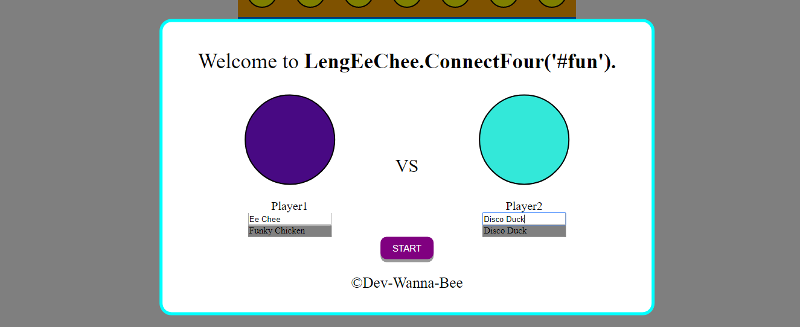
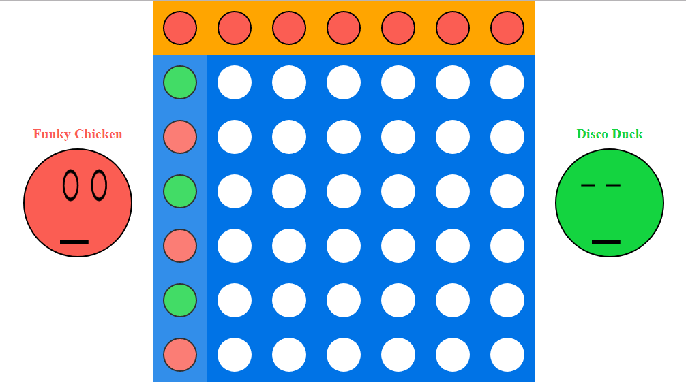

# ConnectFour-Game
In this game players take turns dropping their pieces into one of seven columns that have six rows of slots. The first player to get their pieces into four slots that are vertically, horizontally, or diagonally contiguous wins the game.

Visit my ConnectFour here and have fun: https://connect4-eechee.herokuapp.com/

Features:
* Welcome and pre-settings page. Users are redirected to a welcome page before game. Here is also where users can select their own colour(only two different colours are allowed) and set their name before game (default name is available).

* Both emoji faces pop out slowly as the game starts.
* The very top row indicates the colour of the current player's turn. 
* Players take turn to drop their piece. If the column is full of pieces, players cannot fill the column anymore.    
* During the game, the eyes of both emoji are animated. Player 1 (the left one) blinks every 2 seconds whereas player 2 blinks every 3 seconds.  
* As a player clicks on either one of the columns, a piece drops down, moving over all the empty slots and stops when the next slot is occupied. During the transitioning, any clicks made by players have no effects to the game.

