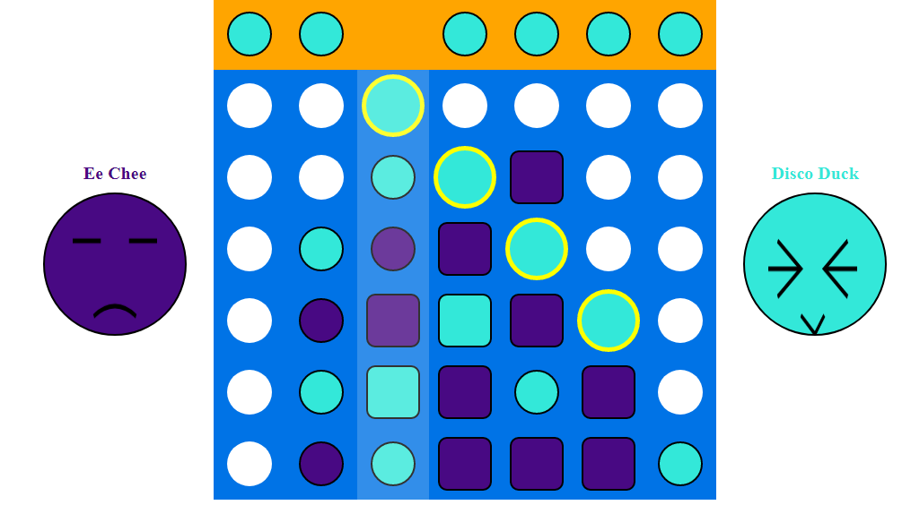

# ConnectFour-Game
In this game players take turns dropping their pieces into one of seven columns that have six rows of slots. The first player to get their pieces into four slots that are vertically, horizontally, or diagonally contiguous wins the game.

Visit my ConnectFour here and have fun: https://connect4-eechee.herokuapp.com/

## Features
* Welcome and pre-settings page. Users are redirected to a welcome page before game. Here is also where users can select their own colour(only two different colours are allowed) and set their name before a game starts(default name is available).

* Both emoji faces pop out slowly as the game starts.
* The very top row indicates the colour of the current player's turn. 
* Players take turn to drop their piece. If the column is full of pieces, players cannot fill the column anymore.    
* During the game, the eyes of both emoji are animated. Player 1 (the left one) blinks every 2 seconds whereas player 2 blinks every 3 seconds.  
* As a player clicks on one of the columns, a piece drops down, moving over all the empty slots and stops if the next slot is occupied. During the transitioning, any clicks made by players have no effects to the game.
* As soon as a transitioning piece reaches the last empty slot, the mario-bros-coin sound effect is triggered. Check it out! It is fun.

* Upon striking 3 pieces, the 3 pieces get bigger and change squere shape to alert players about the winning.
* The first player who strikes all the 4 pieces wins the game. The 4 pieces change back to big circle shape, outlined by a yellow border line.  
* Upon winning, the both emoji faces change accordingly and the mario-bros-clear sound effect is triggered. So play until the end please :D! 
* The click event is cancelled as the game ends.

**_NOTES_**:
* Coding technologies: HTML, CSS, Javascript, Canvas and Jquery
* The most challenging part of this project is finding the solution for diagonal winning.
* In order to deploy only HTML files on Heroku, change index.html to index.php. Heroku will detect it as a PHP site and use that buildpack. OR try [this](https://stackoverflow.com/questions/17343354/deploy-html-only-app-to-heroku).
